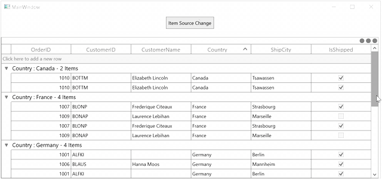

# How to Maintain the ScrollBar Value when ItemsSource Changed in WPF DataGrid?

The sample show cases how to maintain the scroll bar value when [ItemsSource](https://help.syncfusion.com/cr/wpf/Syncfusion.UI.Xaml.Grid.SfDataGrid.html#Syncfusion_UI_Xaml_Grid_SfDataGrid_ItemsSource) changed in [WPF DataGrid](https://www.syncfusion.com/wpf-ui-controls/datagrid) (SfDataGrid).

The `DataGrid` cannot maintain the scrollbar position when `ItemsSource` changed. But you can achieve this by get and set the scrollbar position using [SfDataGrid.ItemsSourceChanged](https://help.syncfusion.com/cr/wpf/Syncfusion.UI.Xaml.Grid.SfDataGrid.html#Syncfusion_UI_Xaml_Grid_SfDataGrid_ItemsSourceChanged) event.

```c#
this.dataGrid.ItemsSourceChanged += DataGrid_ItemsSourceChanged;

private void DataGrid_ItemsSourceChanged(object sender, GridItemsSourceChangedEventArgs e)
{
    if (columnName.Count > 0)
    {
        foreach (var col in columnName)
        {
            this.dataGrid.GroupColumnDescriptions.Add(new GroupColumnDescription() { ColumnName = col });
        }
        foreach (Group group in dataGrid.View.Groups)
        {
            var isExpandGroup = group;
            var key = expandedGroups.FirstOrDefault(colu => colu.Key.ToString() == isExpandGroup.Key.ToString());
            do
            {
                if (key != null)
                    dataGrid.ExpandGroup(isExpandGroup);

                if (isExpandGroup.Groups != null)
                {
                    isExpandGroup = isExpandGroup.Groups[0];
                    key = expandedGroups.FirstOrDefault(col => col.Groups[0].Key.ToString() == group.Groups[0].Key.ToString());
                }
                else
                    isExpandGroup = null;
            } while (isExpandGroup != null);
        }
    }
    VisualContainer container = this.dataGrid.GetVisualContainer();
    container.ScrollRows.ScrollBar.Value = this.Scrollbarvalue;
    container.InvalidateMeasureInfo();
}

private void Button_Click_1(object sender, RoutedEventArgs e)
{
    var groups = dataGrid.View.Groups;
    foreach (Group group in groups)
    {
        if (group.IsExpanded)
            expandedGroups.Add(group);
    }
    foreach (GroupColumnDescription groupColumnDescriptions in dataGrid.GroupColumnDescriptions)
        columnName.Add(groupColumnDescriptions.ColumnName);
    VisualContainer container = this.dataGrid.GetVisualContainer();
    double scrollValue = container.ScrollRows.ScrollBar.Value;
    this.Scrollbarvalue = scrollValue;
    //change Items source
    this.dataGrid.ItemsSource = viewModel.Ordersnew;
}
```

